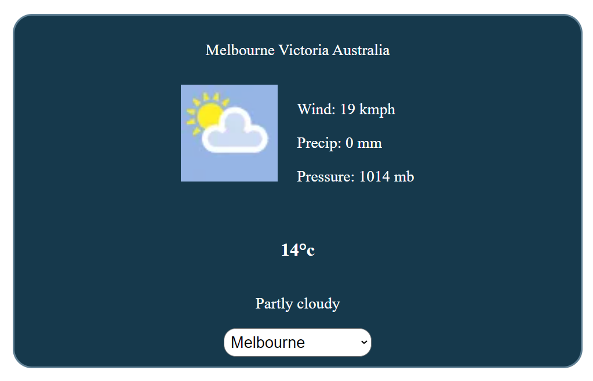

# READ ME

## About the API
Uses the weatherstack api to retrieve instant, accurate weather information for
any location in the world in lightweight JSON format.

See their website for more reference:
https://weatherstack.com/

For their documentation:
https://weatherstack.com/documentation

### Current Weather
Consumes the current weather endpoint of the api

Request:

```javascript
http://api.weatherstack.com/current?access_key=YOUR_ACCESS_KEY&query=New York
```

Response:
```javascript
{
    "request": {
        "type": "City",
        "query": "New York, United States of America",
        "language": "en",
        "unit": "m"
    },
    "location": {
        "name": "New York",
        "country": "United States of America",
        "region": "New York",
        "lat": "40.714",
        "lon": "-74.006",
        "timezone_id": "America/New_York",
        "localtime": "2019-09-07 08:14",
        "localtime_epoch": 1567844040,
        "utc_offset": "-4.0"
    },
    "current": {
        "observation_time": "12:14 PM",
        "temperature": 13,
        "weather_code": 113,
        "weather_icons": [
            "https://assets.weatherstack.com/images/wsymbols01_png_64/wsymbol_0001_sunny.png"
        ],
        "weather_descriptions": [
            "Sunny"
        ],
        "wind_speed": 0,
        "wind_degree": 349,
        "wind_dir": "N",
        "pressure": 1010,
        "precip": 0,
        "humidity": 90,
        "cloudcover": 0,
        "feelslike": 13,
        "uv_index": 4,
        "visibility": 16
    }
}
```

## Run the project
In the project directory, you can run:

To run the backend spring boot in dev mode using Intellij
1. Go to src/main/java/co.medirecords.exam/ExamApplication
2. Right click and choose 'More Run/Debug'
3. Click modify run configuration
4. Type active profiles as dev (run on dev by default if environment is not set)

To build the app
To run the front end react app in dev mode
1. Go to react-frontend directory
2. In the terminal type `npm install` then ``npm run start`
3. Open [http://localhost:3000](http://localhost:3000) to view it in your browser.

UI Preview

